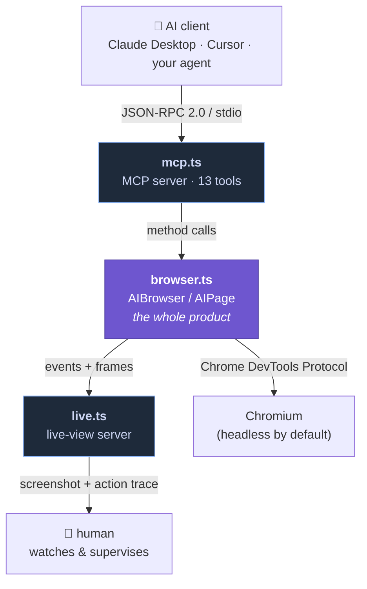
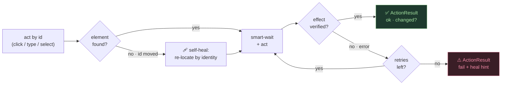
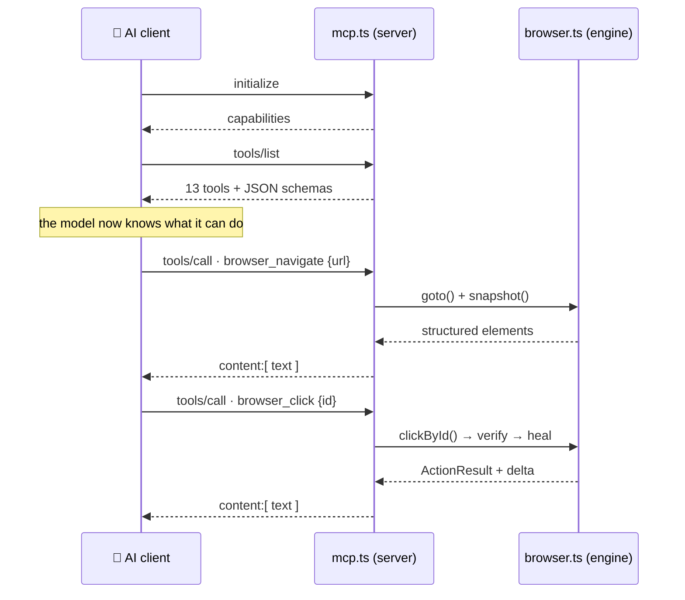
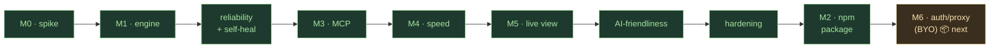

<div align="center">

# 🌐 ecobrowser — AI-Native Browser Framework

### The AI's hands and eyes on the web

**A browser built to be driven by an AI** — the perception and action layer that gives an agent
fast, complete, *verifiable* control of the web. Ships on npm as **`ecobrowser`**: a **TypeScript library** and an **MCP server** in one package.


*Structured (no-pixel) perception · verified self-healing actions · incremental diff perception · a live view to watch it work.*

</div>

---

## Table of contents

- [What is this?](#what-is-this)
- [Highlights](#-highlights)
- [Architecture](#-architecture)
- [How it works](#-how-it-works)
- [Quick start](#-quick-start)
- [MCP tools](#-mcp-tools)
- [How it compares](#-how-it-compares-measured)
- [Configuration](#-configuration)
- [Scripts](#-scripts)
- [Project layout](#-project-layout)
- [Security & scope](#-security--scope)
- [Roadmap](#-roadmap)

---

## What is this?

Most "AI browsers" are one of two things: a chat sidebar bolted onto a browser, or a headless scraping API with no feedback loop. This is neither. It's the **layer that makes a real browser usable _by a model_** — the primary "user" is an AI, and a human just supervises.

It gives an agent a compact, **structured** view of a page (an addressable list of interactive elements, not a screenshot), lets it act on those elements **by stable id**, tells it **whether each action actually worked**, and streams the whole thing to a **live view** a human can watch. It's model-agnostic and downloadable — not tied to one vendor's extension.

> **The design principle, everywhere:** _do work in code so the model doesn't spend tokens and reasoning on it_ — verifying outcomes, diffing pages, recovering from failures, finding elements.

> ⚠️ **Scope & honesty.** This is a fast, local, **single-user developer tool**, built to be pointed at your own or authorized sites. It's young — thoroughly tested on its own paths, but not battle-hardened across thousands of real websites the way mature tools are. See [Security & scope](#-security--scope).

---

## ✨ Highlights

| | |
|---|---|
| 👁️ **Structured perception** | The AI sees a compact list of interactive elements with stable ids — no screenshot→vision round-trip. |
| 🎯 **Act by id** | Click/type/select by `e3`, never by guessed CSS selectors or pixel coordinates. |
| ✅ **Verified actions** | Every action returns *did it work and did the page change* — success / silent no-op / failure, not a guess. |
| 🩹 **Self-healing** | If an element's id moved (page re-rendered), it re-locates the element by identity and retries. |
| 🔗 **Durable ids** | An element keeps its id across snapshots, so the AI can reference something it saw steps ago. |
| ⚡ **Incremental perception** | `changes()` returns only the delta; snapshots are cached until the DOM actually changes. |
| 🔎 **`find(description)`** | Ask for "the search box" and get just the match — not a whole-page dump. |
| 🐛 **First-class debugging** | Console logs, page errors, and network requests captured — errors scoped to the action that caused them. |
| 🖥️ **Live view** | Watch a headless run in your browser — refreshing screenshot + colour-coded action trace. |
| 🔌 **MCP + npm** | One engine, two front doors: an MCP server (zero-code) and a typed TypeScript library. |

---

## 🏗 Architecture



**One engine, two front doors.** All the real logic lives in `browser.ts`. `mcp.ts` is a thin adapter that exposes the engine's methods as protocol tools; `live.ts` is a read-only window for a human. The same engine could be wrapped as a CLI or REST API — MCP is just one adapter.

---

## 🧠 How it works

### Perception → action → verification



Perception runs a script *inside the page* that collects interactive elements, stamps each with a **durable** `data-ai-id`, and captures role / name / value / state. A `MutationObserver` tracks a DOM version, so unchanged snapshots are served from **cache** and `changes()` can return just the **delta**.

### The MCP conversation



It's **an MCP server** because it registers schema-typed tools and answers `initialize` / `tools/list` / `tools/call` as JSON-RPC 2.0 over stdio — the browser control is just what those tools happen to do.

---

## 🚀 Quick start

**Prerequisites:** Node.js 18+.

```bash
npm install ecobrowser
```

Chromium is downloaded automatically on install (a `postinstall` hook). If you
install with `--ignore-scripts`, fetch it manually: `npx playwright install chromium`.

### Option A — as an MCP server (drive it from an AI)

**Claude Desktop** — add to `claude_desktop_config.json`:

```json
{
  "mcpServers": {
    "ecobrowser": {
      "command": "npx",
      "args": ["-y", "ecobrowser-mcp"],
      "env": { "AI_BROWSER_HEADED": "1" }
    }
  }
}
```

**Claude Code:**

```bash
claude mcp add ecobrowser -- npx -y ecobrowser-mcp
```

Restart the client, then just ask: *"navigate to example.com and list the links."*

Run `npx ecobrowser-mcp --help` for setup, the full tool list, and environment variables.

*(Working from a clone instead of the published package? Point the client at the source directly: `npx tsx <repo>/src/mcp.ts`.)*

### Option B — as a TypeScript library

```ts
import { AIBrowser } from "ecobrowser";

const browser = await AIBrowser.launch({ headless: true });
const page = await browser.newPage();

await page.goto("https://example.com");

const snap = await page.snapshot();          // { url, title, elements: [{ id, tag, role, name, value?, state? }] }
const [search] = await page.find("search box");

const result = await page.clickById(snap.elements[0].id);
console.log(result.detail);                  // "click e0 succeeded (page changed)."

const diff = await page.changes();           // { added, removed, changed, unchanged }
console.log(page.console(), page.network()); // first-class debugging

await browser.close();
```

---

## 🧰 MCP tools

The server exposes **13 tools**; an MCP client discovers them (name + JSON schema) via `tools/list`.

| Tool | What it does |
|---|---|
| `browser_navigate` | Open a URL, return a structured snapshot. |
| `browser_snapshot` | Structured snapshot of the current page (cached until it changes). |
| `browser_changes` | **Only** what changed since your last snapshot — cheap re-perception. |
| `browser_find` | Find interactive elements matching a description; get just the matches. |
| `browser_read_text` | Visible text of the page. |
| `browser_back` | Go back in history. |
| `browser_click` | Click an element by id (verified, self-healing); returns the delta. |
| `browser_type` | Type into a field by id (verifies the value landed). |
| `browser_console` | Console logs + page errors on the current page. |
| `browser_network` | Network responses (status, method, url). |
| `browser_evaluate` | Run a JS **expression** in the page, return the result. |
| `browser_extract_links` | All links as name/href pairs. |
| `browser_reset` | Discard the session; the next action starts fresh (crash recovery). |

---

## 📊 How it compares (measured)

Head-to-head vs **Playwright MCP** on the same page (`npm run bench`), measuring **bytes returned to the model** and tool latency.

**Full page snapshot** — *smaller is better*
```
This framework   ███████░░░░░░░░░░░░░░░░░   41 KB   (~10K tokens)
Playwright MCP   ████████████████████████  128 KB   (~32K tokens)
```

**Re-perceive latency** — *smaller is better*
```
This framework   ▏                           5 ms   (cache hit)
Playwright MCP   ████████████████████████  150 ms   (re-serializes every time)
```

**Incremental re-perceive after an action**
```
This framework   ▏  delta only (bytes)
Playwright MCP   ████████████████████████  full page again  (no diff primitive)
```

> **Honest caveats.** This measures **perception payload + tool latency**, not end-to-end LLM wall-clock (no live model ran). Part of the size gap is *scope* — we capture interactive elements only, Playwright MCP captures the full accessibility tree. And we're faster than **Playwright MCP** (the wrapper), **not** Playwright (the shared engine under both) — the wins are caching, diffing, and a leaner format, all ideas a competitor could adopt.

---

## ⚙️ Configuration

| Env var | Effect |
|---|---|
| `AI_BROWSER_HEADED=1` | Show the native browser window (default: headless). |
| `AI_BROWSER_LIVE=0` | Disable the live-view server. |
| `AI_BROWSER_LIVE_PORT=N` | Preferred live-view port (default `7333`, steps to the next free port if busy). |
| `AI_BROWSER_ALLOW_LOCAL=1` | Allow `file://` / privileged-scheme navigation (blocked by default). |

**Live view:** when the MCP server starts it also serves a loopback-only page (default `http://localhost:7333`) — a refreshing screenshot plus a colour-coded action trace — so you can watch a headless run.

---

## 📜 Scripts

```bash
npm test           # unit tests (diff, find, state, url-guard) — no browser needed
npm run build      # compile the publishable package to dist/ (library + MCP bin)
npm run typecheck  # tsc --noEmit over everything, dev scripts included
npm run demo       # exercises the engine directly (headed; AI_BROWSER_HEADED=0 for headless)
npm run smoke      # spawns the MCP server as a real MCP client and drives it
npm run live       # starts the live view and verifies its endpoints
npm run bench      # head-to-head vs Playwright MCP
npm run mcp        # run the MCP server on stdio
```

> **Benchmark note:** Playwright MCP is a `devDependency`; install its browser once with
> `npx @playwright/mcp install-browser chrome-for-testing` before `npm run bench`.

---

## 🗂 Project layout

```
src/
  index.ts         # public package entry — re-exports the engine + LiveView
  browser.ts       # the core engine — AIBrowser / AIPage (this is the whole product)
  mcp.ts           # MCP server: registers the engine's methods as 13 tools (the ecobrowser-mcp bin)
  live.ts          # live-view server (screenshot + action trace)
  demo.ts          # in-code engine demo (5 parts, incl. self-healing)
  mcp-smoke.ts     # end-to-end MCP client test
  live-smoke.ts    # live-view endpoint test
  bench-h2h.ts     # head-to-head benchmark vs Playwright MCP
  test.ts          # unit tests for the pure logic
tsconfig.build.json # build config — compiles only the public surface to dist/
SPEC.md            # full technical specification, north star, roadmap
```

Only `dist/` (plus README, SPEC, LICENSE) ships in the npm tarball — the dev scripts stay in the repo.

---

## 🔒 Security & scope

Because it's a **downloadable tool you run yourself**, how it's used is your responsibility. Built-in guards:

- **Loopback-only live view** — never exposed to the LAN; the trace is rendered XSS-safely (`textContent`, never `innerHTML`).
- **Navigation guard** — `file://`, `chrome://`, `javascript:` and other privileged schemes blocked by default (`AI_BROWSER_ALLOW_LOCAL=1` to opt out).
- **Bounded & recoverable** — capped logs, per-tool timeouts, automatic crash recovery, graceful shutdown, port fallback.

Deliberately **not** in scope: multi-tenant hosting, auth/session isolation between users, or sandboxing `browser_evaluate` (which runs arbitrary JS in the page — appropriate only for sites you trust). Point it at your own or authorized sites.

---

## 🗺 Roadmap



Built and tested: the engine, reliability + self-healing, the MCP server, caching + diff perception, the live view, the AI-friendliness pass, the hardening pass, and the npm package (`ecobrowser`, with the `ecobrowser-mcp` bin).
**Next — M6:** opt-in, BYO-key auth/proxy/CAPTCHA for authorized sites.

See [`SPEC.md`](./SPEC.md) for the full specification and north star.

---

<div align="center">
<sub>Built as an AI-first browser layer — the AI's hands and eyes on the web.</sub>
</div>


---

## 👤 Author

**Built by [Haidar Esber](https://haidaresber.github.io)** — Lebanese software & web developer based in France.

[Portfolio](https://haidaresber.github.io) · [GitHub](https://github.com/HaidarESBER) · [LinkedIn](https://www.linkedin.com/in/haidaresber)
